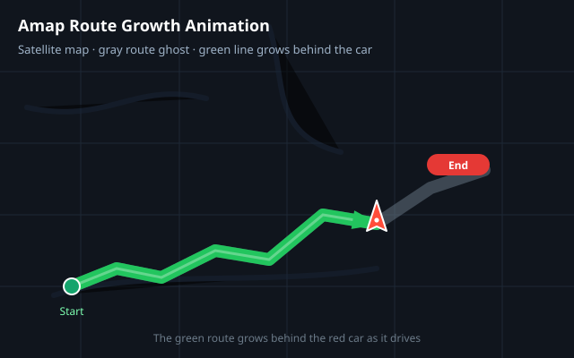

# 🛣️ Amap Route Growth Animation

Turn any **Amap (高德地图)** driving route into a **route-growth animation video** — automatically, with zero manual keyframes.



## 🎬 Demo

Here is a real output — the 51.8 km drive from **普洱市 to 普洱太阳河森林公园** (Pu'er, Yunnan), rendered on Amap satellite imagery at 1080p / 15 s:

<video src="https://github.com/captainchn/amap-route-animation/raw/main/demo/puer_taiyanghe_route_growth.mp4" controls width="720"></video>

> ⚠️ 内嵌播放器依赖 `raw.githubusercontent.com`（GitHub 的 raw CDN），国内浏览器需能访问该域名。
> Download: [demo/puer_taiyanghe_route_growth.mp4](demo/puer_taiyanghe_route_growth.mp4)

## ✨ What it produces

A **.mp4** of the route with:

- 🛰️ **Amap satellite map** — real terrain, roads, and landscape (GCJ-02, perfectly aligned with the route data — **no coordinate conversion needed**)
- ⬜ **Gray full-route ghost** — shows the whole path up front
- 🟢 **Route line grows** behind the car, frame by frame
- 🚗 **Car arrow** drives from start to finish, rotating with the road's heading
- 🏁 **Start / End labels**
- ⏱️ **Ease-in-out pacing** — slow start, fast middle, slow finish

## 🧰 Features

- **Fully automated**: place names → animation video, one command
- **Real navigation data**: uses Amap's driving-direction API (exact turn-by-turn polylines)
- **Zero manual keyframes** — every frame is driven by `window.setProgress(0..1)`
- **Clean, self-contained rendering** — a single HTML page + Playwright + ffmpeg
- **Runs headless** — no browser interaction, deterministic frame capture

## 📋 Requirements

- Python **3.9+**
- **Playwright** (with a Chromium browser): `pip install -r requirements.txt` then `python -m playwright install chromium`
- **ffmpeg** (on macOS: `brew install ffmpeg`)
- A free **Amap (高德地图)** API key — one key covers geocoding, routing, and the JS map
  - Get it at https://console.amap.com/ → 应用管理 → 创建应用 → 添加 Key
  - If you get `INVALID_USER_SCODE`, add a **安全密钥 (securityJsCode)** to the render page, or whitelist `127.0.0.1` as a Web service referer

## 🚀 Quick Start

```bash
# 1. Install dependencies
pip install -r requirements.txt
python -m playwright install chromium

# 2. Set your Amap API key
export AMAP_KEY="your_amap_key_here"

# 3. One command — place names to video
./run.sh "普洱市" "普洱太阳河森林公园" puer_taiyanghe
```

Or run the steps individually:

```bash
python3 scripts/fetch_route.py  "普洱市" "普洱太阳河森林公园" route.json   # geocode + routing
python3 scripts/prepare_web.py  route.json                                 # inject into render page
python3 scripts/capture.py      450 30                                      # screenshot frames
python3 scripts/encode.py       30 puer_taiyanghe                           # ffmpeg -> mp4
```

Output lands in `output/`. Tunables: `FRAMES` / `FPS` env vars, resolution in `scripts/capture.py` (`W, H`).

## ⚙️ How it works

1. **Fetch** — Amap geocoding API turns place names into coordinates; the driving API returns GCJ-02 polylines (`scripts/fetch_route.py`).
2. **Render** — `web/render_template.html` loads the Amap JS API and draws the full-route ghost, the growing green line, and a heading-rotated car. It exposes `window.setProgress(p)` to drive the animation at any progress `0→1`.
3. **Capture** — Playwright opens the page headless, waits for the map and tiles, then screenshots one frame per progress step.
4. **Encode** — ffmpeg stitches the PNG sequence into an h264 mp4.

Because both the route data and the map use **GCJ-02**, the line always sits exactly on the roads — no drift, no conversion math.

## 🎨 Customization

Edit `web/render_template.html`:

| What | Where to look |
|---|---|
| Route / line colors & width | `strokeColor` / `strokeWeight` on the two polylines |
| Car icon | `carEl.innerHTML` (any SVG) |
| Start/end label style | `.node-label` CSS |
| Easing curve | `function ease` |
| Map style (satellite → normal) | `layers: [sat, road]` in `AMap.Map` |

## 📁 Project layout

```
├── run.sh                       one-command pipeline
├── scripts/
│   ├── fetch_route.py           Amap routing + geocoding → route.json
│   ├── prepare_web.py           route.json + AMAP_KEY → web/index.html
│   ├── capture.py               Playwright frame capture
│   └── encode.py                ffmpeg → mp4
├── web/render_template.html     the animation page (edit styles here)
├── demo/                        sample output video
└── docs/                        diagrams
```

## 📄 License

MIT — see [LICENSE](LICENSE).
